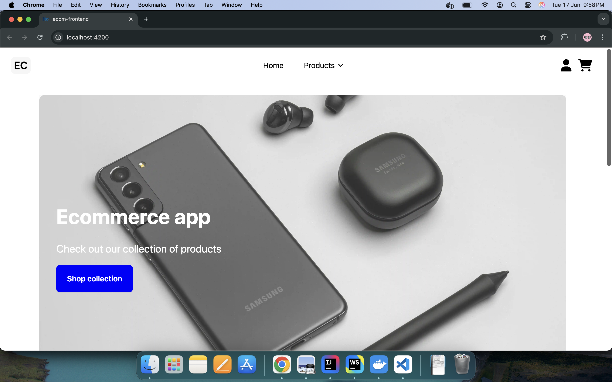
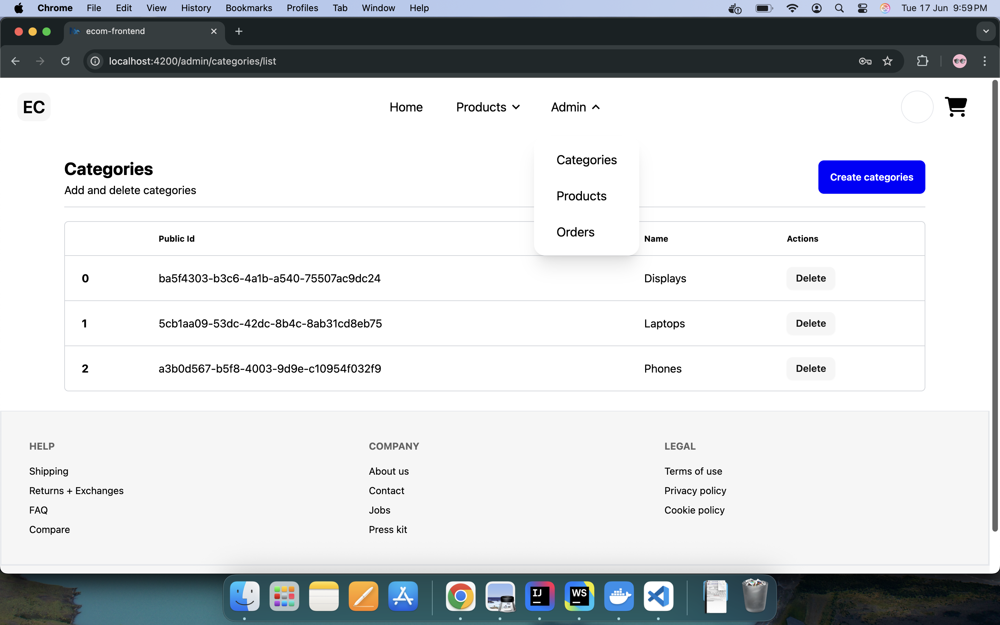
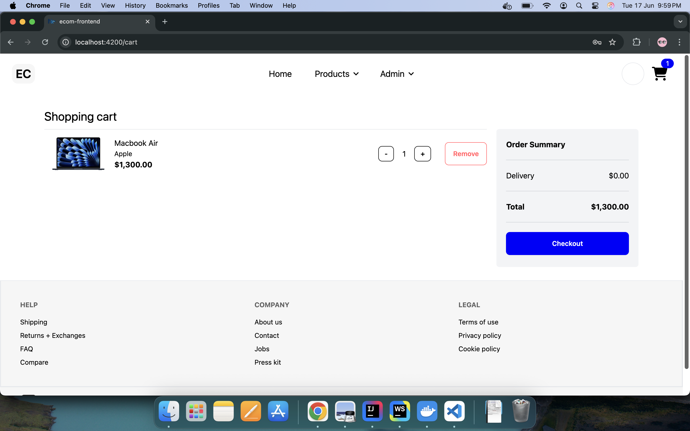
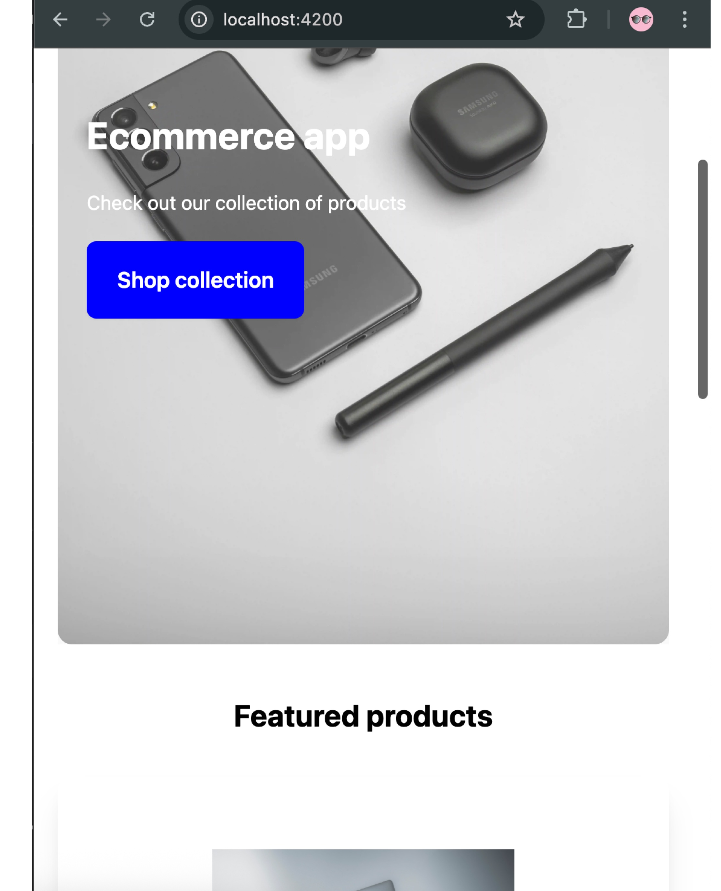

# EcommerceAppClone

<a alt="Nx logo" href="https://nx.dev" target="_blank" rel="noreferrer"></a>

✨ **EcommerceApp** is a modern e-commerce platform built using Angular,and Spring Boot. It leverages the Nx monorepo structure for efficient development and scalability.
Libraries include TailwindCSS, DaisyUI, Kinde, Stripe.
---

## Table of Contents
1. [Features](#features)
2. [Tech Stack](#tech-stack)
3. [Getting Started](#getting-started)
4. [Project Structure](#project-structure)
5. [Development](#development)
6. [Production Build](#production-build)
7. [Testing](#testing)
8. [Screenshots](#screenshots)

---

## Features
- **Admin Dashboard**: Manage orders, products, and categories of products.
- **User-Friendly Interface**: Responsive design for seamless shopping.
- **Order Management**: View and track orders with detailed information.
- **Stripe Integration**: Secure payment processing. NOTE - As this is a clone, don't enter original card details.
- **Kinde Integration**: Authentication and authorization using Kinde for secure user management.
- **Security Configuration**: Backend and frontend are secured with role-based access control and token-based authentication.
- **User Order History**: Users can view their past orders with detailed information.
- **Nx Monorepo**: Efficient workspace management.
---

## Tech Stack
- **Frontend**: Angular, TypeScript, TailwindCSS
- **Backend**: Spring Boot, Java
- **Build Tools**: Maven, Nx
- **Database**: PostgresSQL, Liquibase
- **Payment Gateway**: Stripe
- **Auth**: Kinde
---

## Getting Started

### Prerequisites
- Node.js (v20+)
- npm (v10+)
- Java (JDK 17+)
- Angular (v18+)

### Installation
1. Clone the repository:
   ```sh
   git clone https://github.com/Pra8al/Ecommerce-app.git
   cd Ecommerce-app
   ```
2. Install dependencies:
   ```sh
   npm install
   ```
3. Start the development server:
   ```sh
   npx nx serve ecom-frontend
   ```

4. Run the backend:
   ```sh
   mvn spring-boot:run
   or
   npx nx serve ecom-backend
   ```

---

## Project Structure
- **apps/ecom-frontend**: Angular frontend application.
- **apps/ecom-backend**: Spring Boot backend application.

---

## Development

- **Backend**: The backend follows the **Hexagonal Architecture** for better separation of concerns and scalability.
- **Frontend**: The frontend uses **TanStack Query** for efficient state management and data fetching.

### Setting up PostgresSQL with Docker
To run the backend, you need to set up a PostgreSQL database using Docker. Below is an example `docker-compose.yml` file:

```yaml
version: '3.8'
services:
  postgres:
    image: postgres:15
    container_name: ecommerce_postgres
    restart: always
    environment:
      POSTGRES_USER: postgres
      POSTGRES_PASSWORD: yourpassword
      POSTGRES_DB: ecommerce_db
    ports:
      - "5432:5432"
    volumes:
      - postgres_data:/var/lib/postgresql/data

volumes:
  postgres_data:
```

Run the following command to start the container:
```sh
docker-compose up -d
```

### Setting up the `.env` File
The `.env` file is required to configure environment variables for the backend. Below are examples:

```env
SPRING_DATASOURCE_URL=jdbc:postgresql://localhost:5432/ecommerce_db
SPRING_DATASOURCE_USERNAME=postgres
SPRING_DATASOURCE_PASSWORD=yourpassword
SPRING_JPA_HIBERNATE_DDL_AUTO=update
STRIPE_SECRET_KEY=your_stripe_secret_key
STRIPE_PUBLIC_KEY=your_stripe_public_key
KINDE_CLIENT_ID=your_kinde_client_id
KINDE_CLIENT_SECRET=your_kinde_client_secret
KINDE_ISSUER_URL=your_kinde_issuer_url
```

### Additional Commands
- To create a new Angular component (provided example) using Nx:
  ```sh
  nx g @nx/angular:component --directory=apps/ecom-frontend/src/app/user user-orders --project ecom-frontend
  ```
- To create a new Angular service (provided example) using Nx:
  ```sh
  nx g @nx/angular:service shared/service/order --project ecom-frontend
  ```

---

## Testing
- Run unit tests:
  ```sh
  npx nx test ecom-frontend
  ```
- Run end-to-end tests:
  ```sh
  npx nx e2e ecom-frontend-e2e
  ```

---

## Screenshots

### Homepage


### Admin Dashboard


### Order Details


### Responsive Design



---
